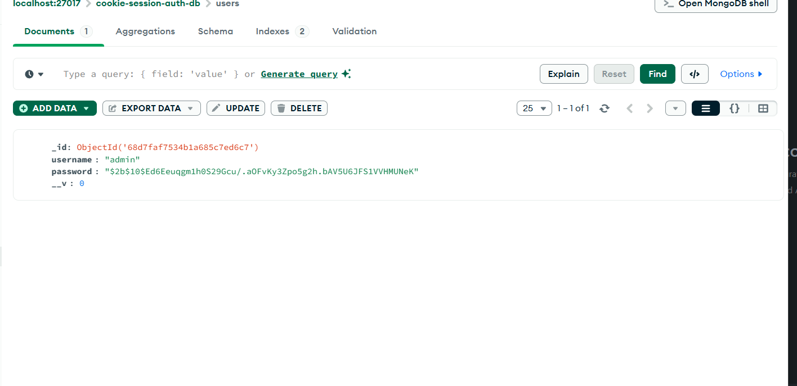
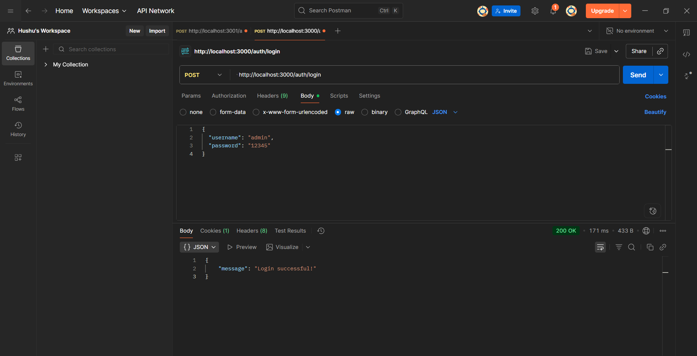
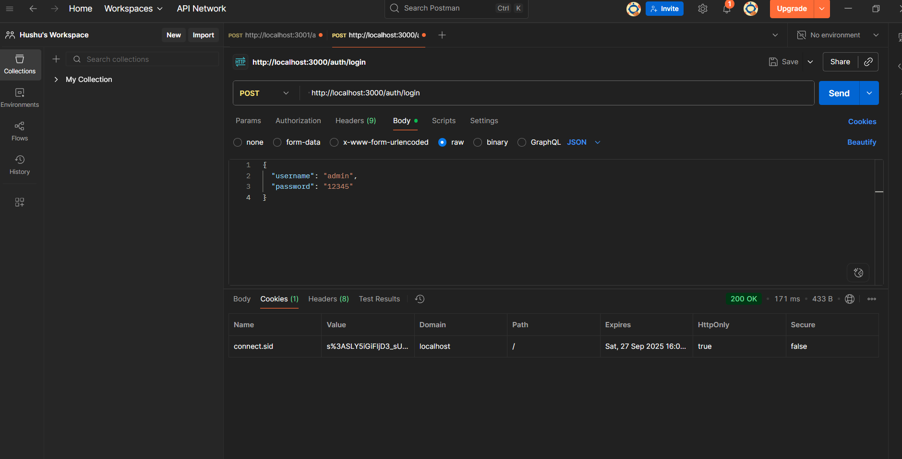
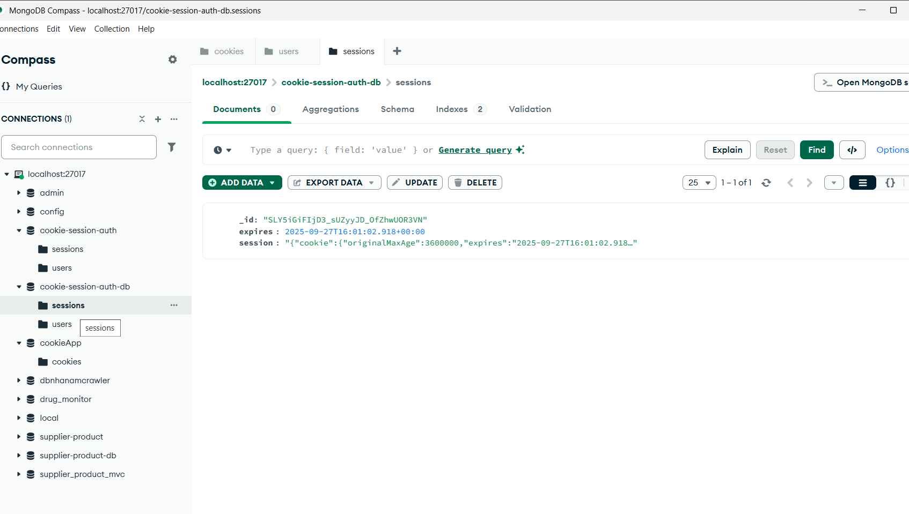
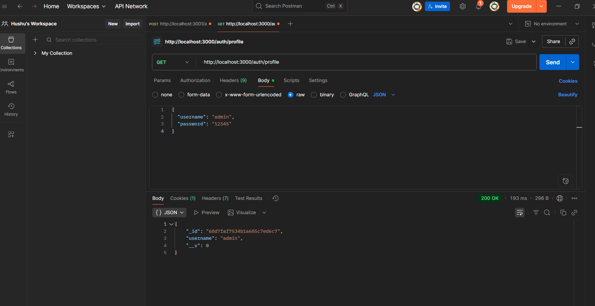
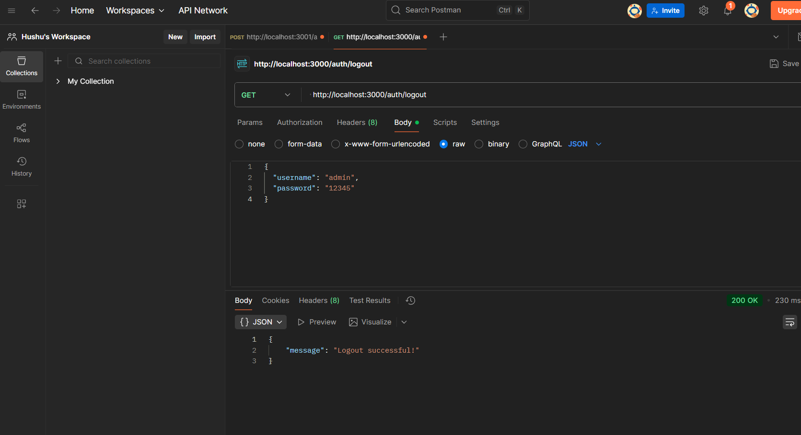
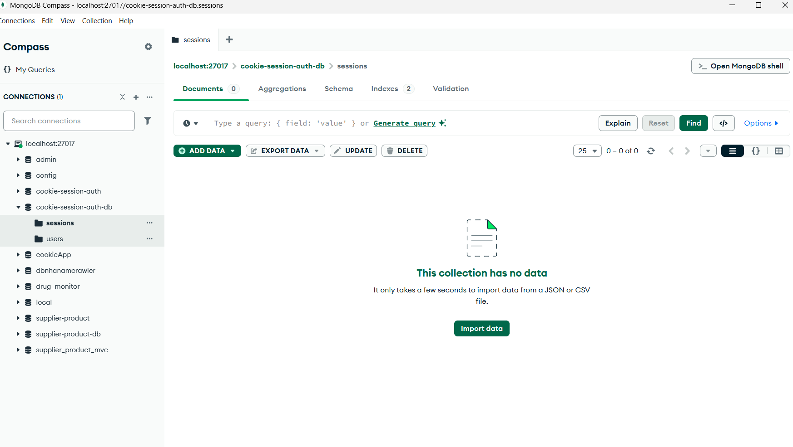

2. cookie_session_auth source code
a. node cookie_auth.js
b. register 
URL: http://localhost:3000/auth/register

URL: http://localhost:3000/auth/login

d. Go to profile  

e. Go to logout and check cookie is deleted in database

database:
